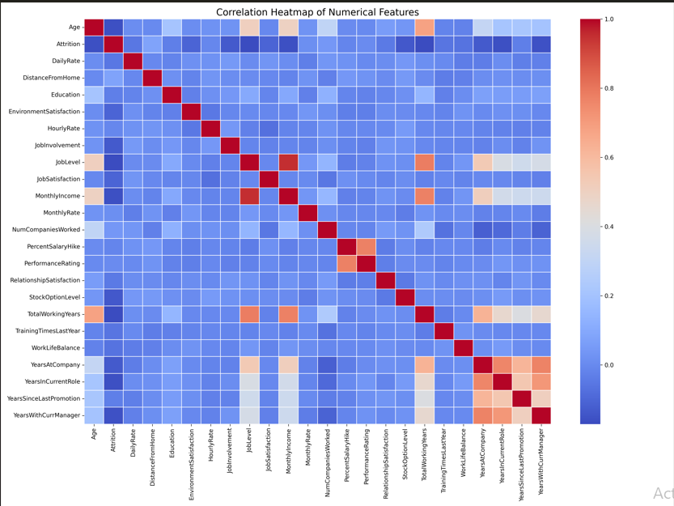
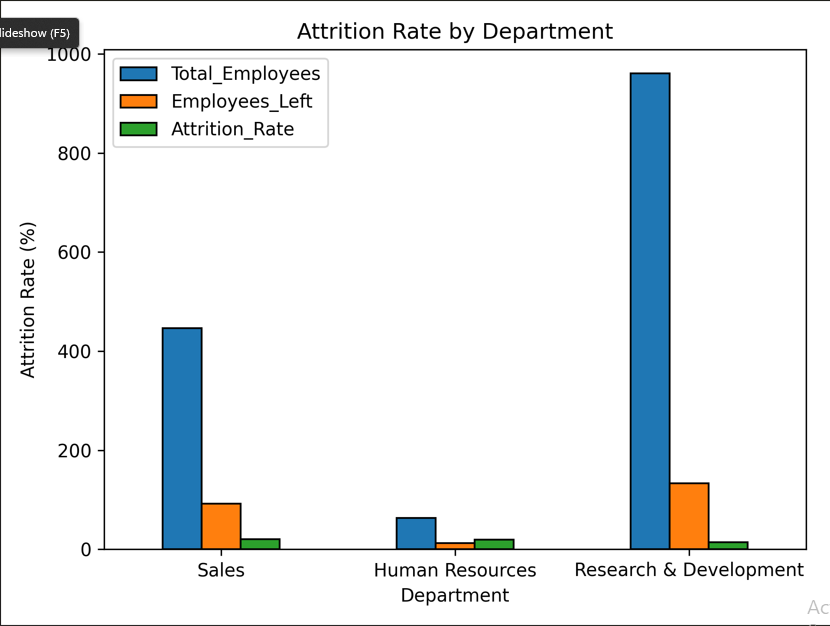
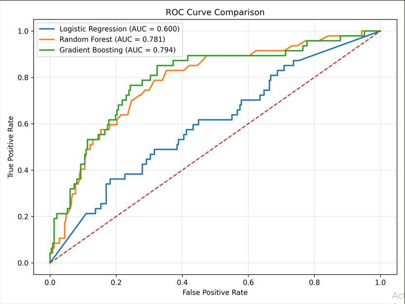
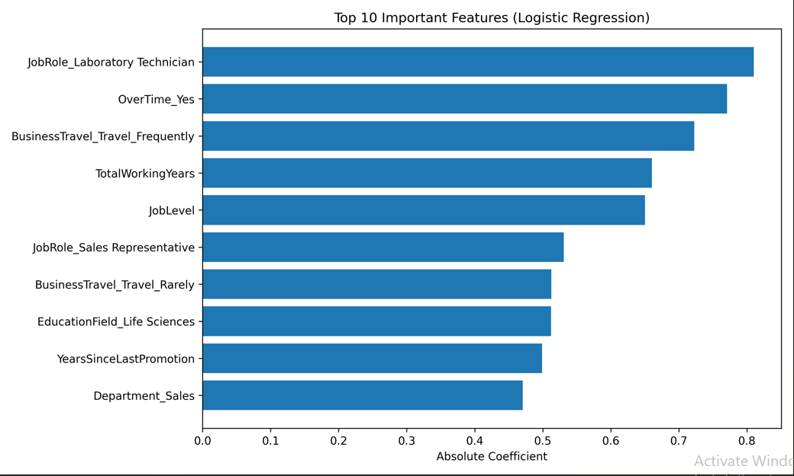
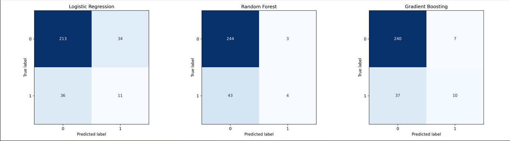

# 📊 Employee Attrition Prediction using Machine Learning

<p align="center">


</p>

---

## 📖 Project Overview

Employee attrition is a major challenge for organizations, leading to increased recruitment costs, productivity loss, and reduced workforce stability.

This project develops a **Machine Learning Classification Model** capable of predicting whether an employee is likely to leave the organization based on HR-related attributes such as job role, income, satisfaction levels, experience, and work environment.

The project follows the complete **Data Science Lifecycle**, including:

- Data Understanding
- Data Cleaning & Preprocessing
- Exploratory Data Analysis (EDA)
- Feature Engineering
- Machine Learning Model Development
- Model Evaluation
- Feature Importance Analysis
- HR Business Recommendations

---

# 🎯 Project Objectives

The primary objectives of this project are:

- Understand employee attrition patterns.
- Perform comprehensive data cleaning.
- Explore relationships among employee attributes.
- Build multiple machine learning classification models.
- Compare model performance using evaluation metrics.
- Identify the best-performing model.
- Determine key drivers of employee attrition.
- Provide actionable HR recommendations.

---

# 📂 Dataset Information

| Item | Description |
|------|-------------|
| Dataset | IBM HR Employee Attrition Dataset |
| Problem Type | Binary Classification |
| Target Variable | Attrition |
| Features | 35+ Employee Attributes |
| Records | 1470 Employees |

### Target Variable

| Value | Meaning |
|--------|---------|
| 0 | Employee Stayed |
| 1 | Employee Left |

---

# 🛠️ Technologies Used

- Python
- Pandas
- NumPy
- Matplotlib
- Seaborn
- Scikit-learn
- Jupyter Notebook

---

# 📚 Project Workflow

```
Data Collection
        │
        ▼
Data Cleaning
        │
        ▼
Exploratory Data Analysis
        │
        ▼
Feature Engineering
        │
        ▼
Train-Test Split
        │
        ▼
Machine Learning Models
        │
        ▼
Model Evaluation
        │
        ▼
Feature Importance
        │
        ▼
Business Insights
        │
        ▼
HR Recommendations
```

---

# 🤖 Machine Learning Models

The following supervised learning algorithms were trained and evaluated:

- Logistic Regression
- Random Forest Classifier
- Gradient Boosting Classifier

Model comparison was performed using:

- Accuracy
- Precision
- Recall
- F1 Score
- ROC-AUC Score
- Confusion Matrix
- ROC Curve

---

# 📈 Model Evaluation Metrics

The models were evaluated using multiple performance metrics to ensure balanced predictive capability.

Evaluation Metrics:

- Accuracy
- Precision
- Recall
- F1 Score
- ROC-AUC

The best-performing model was selected based on the highest overall predictive performance.

---

# 📊 Project Visualizations

The following visualizations summarize the exploratory data analysis and model evaluation conducted during the project.

---

## 🔥 Correlation Heatmap

Illustrates relationships among numerical features.



---

## 📉 Department-wise Attrition

Shows employee attrition across different departments.



---

## 🎯 ROC Curve Comparison

Compares ROC curves for all trained models.



---

## ⭐ Top 10 Feature Importance

Displays the most influential features for employee attrition prediction.



---

## ✅ Confusion Matrix

Shows classification performance of the best model.



---

# 📌 Key Findings

The analysis revealed several important insights:

- Employee attrition is influenced by multiple factors rather than a single variable.
- Job satisfaction and environment satisfaction significantly affect retention.
- Monthly income and total working years show meaningful relationships with attrition.
- Employees with lower job involvement tend to leave more frequently.
- Certain departments experience higher attrition rates.

---

# 💼 Business Recommendations

Based on the findings, HR teams should consider:

- Improving employee engagement programs.
- Monitoring employees with low satisfaction scores.
- Designing competitive compensation strategies.
- Providing clear career progression opportunities.
- Supporting work-life balance initiatives.
- Conducting proactive retention interviews.

---

# 📂 Repository Structure

```
Employee-Attrition-Prediction-ML
│
├── Employee_Attrition_Prediction.ipynb
├── README.md
├── LICENSE
├── requirements.txt
├── .gitignore
│
├── dataset
│   └── employee_attrition.csv
│
├── charts
│   ├── correlation_heatmap.png
│   ├── roc_curve.png
│   ├── feature_importance.png
│   ├── confusion_matrix.png
│   └── department_attrition.png
│
└── screenshots
    ├── correlation_heatmap.png
    ├── roc_curve.png
    ├── feature_importance.png
    ├── confusion_matrix.png
    └── department_attrition.png
```

---

# 🚀 How to Run

Clone the repository:

```bash
git clone https://github.com/Shrishti09-arch/Employee-Attrition-Prediction-ML.git
```

Move into the project folder:

```bash
cd Employee-Attrition-Prediction-ML
```

Install dependencies:

```bash
pip install -r requirements.txt
```

Launch Jupyter Notebook:

```bash
jupyter notebook
```

Open:

```
Employee_Attrition_Prediction.ipynb
```

Run all cells from top to bottom.

---

# 📌 Future Improvements

Potential enhancements include:

- Hyperparameter tuning using GridSearchCV.
- Cross-validation for improved model robustness.
- XGBoost and LightGBM implementation.
- Deployment using Streamlit or Flask.
- Real-time prediction dashboard.
- Explainability using SHAP values.

---

# 📖 References

- IBM HR Analytics Employee Attrition Dataset
- Scikit-learn Documentation
- Pandas Documentation
- NumPy Documentation
- Matplotlib Documentation
- Seaborn Documentation

---

# 👩‍💻 Author

**Shrishti Vaishnav**

B.Tech – Mathematics & Computing

Interested in:

- Data Science
- Machine Learning
- Artificial Intelligence
- Data Analytics

GitHub:

https://github.com/Shrishti09-arch

---

# 📜 License

This project is licensed under the **MIT License**.

See the **LICENSE** file for more information.

---

# ⭐ If you found this project helpful

Please consider giving it a ⭐ on GitHub.

It helps others discover the project and motivates further development.

---

# 🙏 Thank You

Thank you for taking the time to explore this project.

This notebook demonstrates an end-to-end machine learning workflow, from data preprocessing and exploratory analysis to predictive modeling, evaluation, and business-focused recommendations. The insights generated can help HR teams make informed, data-driven decisions to improve employee retention.
